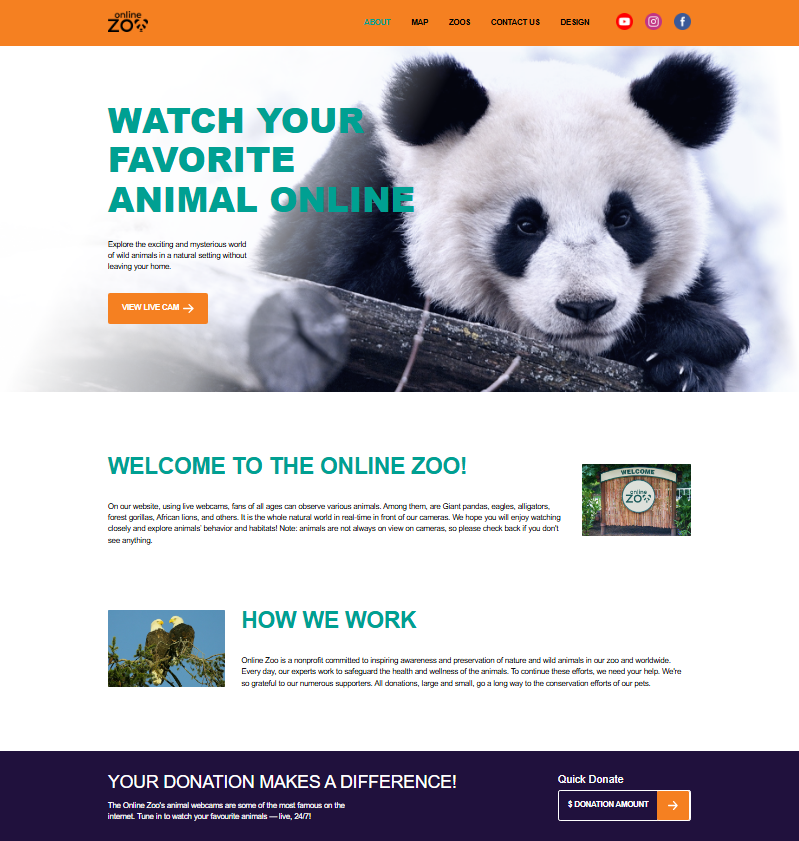

# online-zoo

## Deploy [link](https://vladaworkflow-ops.github.io/online-zoo/pages/landing/index.html)



# 🦁 Online Zoo — Frontend Project

## 📖 Overview

This project is a modern frontend application built with a focus on clean architecture, maintainability, and consistent code style. It leverages a modular setup with TypeScript, SCSS, and modern tooling to ensure scalability and developer efficiency.

---

## 🧰 Tech Stack

- **Bundler:** Vite
- **Language:** TypeScript + JavaScript
- **Styling:** SCSS (Sass preprocessor)
- **Code Quality:** ESLint
- **Code Formatting:** Prettier
- **CSS Reset:** normalize.css

---

## 🎨 Styling

The project uses **SCSS** as a CSS preprocessor, enabling:

- Variables and mixins
- Nested rules
- Modular and maintainable styles

Additionally, **normalize.css** is included to ensure consistent styling across browsers.

---

## 🚀 Available Scripts

### Development

Start development server:

```bash
npm run dev
```

Build project for production:

```bash
npm run build
```

Preview production build:

```bash
npm run preview
```

---

### 🎨 Styles (SCSS)

Compile SCSS to CSS:

```bash
npm run sass
```

Watch SCSS files for changes:

```bash
npm run sass:w
```

---

### 🧹 Code Quality

Run linter:

```bash
npm run lint
```

Format code with Prettier:

```bash
npm run format
```

---

## 📦 Project Tooling

### ESLint

Used for static code analysis and enforcing best practices across both TypeScript and JavaScript files.

### Prettier

Handles consistent code formatting:

- Indentation
- Quotes
- Semicolons
- Line wrapping

### Sass

Compiles SCSS into standard CSS for browser compatibility.

---

## 🛠 Development Notes

- SCSS is compiled manually or in watch mode depending on workflow
- Codebase follows consistent formatting enforced by Prettier
- ESLint ensures code quality and prevents common errors
- Vite provides fast development and optimized builds

---

## 📌 Summary

This project is structured to provide:

- ⚡ Fast development experience (Vite)
- 🧼 Clean and consistent code (ESLint + Prettier)
- 🎨 Scalable styling system (SCSS)
- 🧩 Maintainable architecture

---
